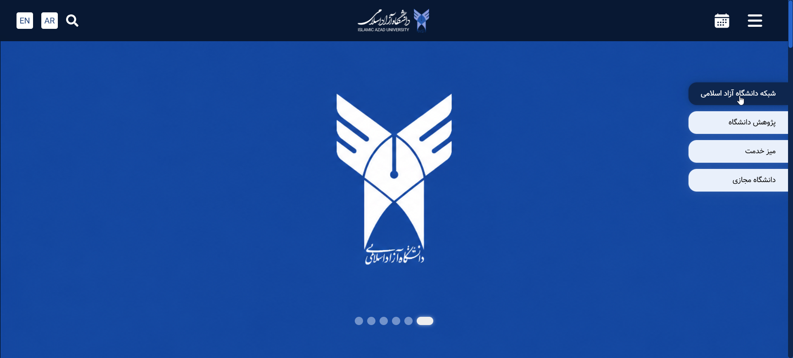
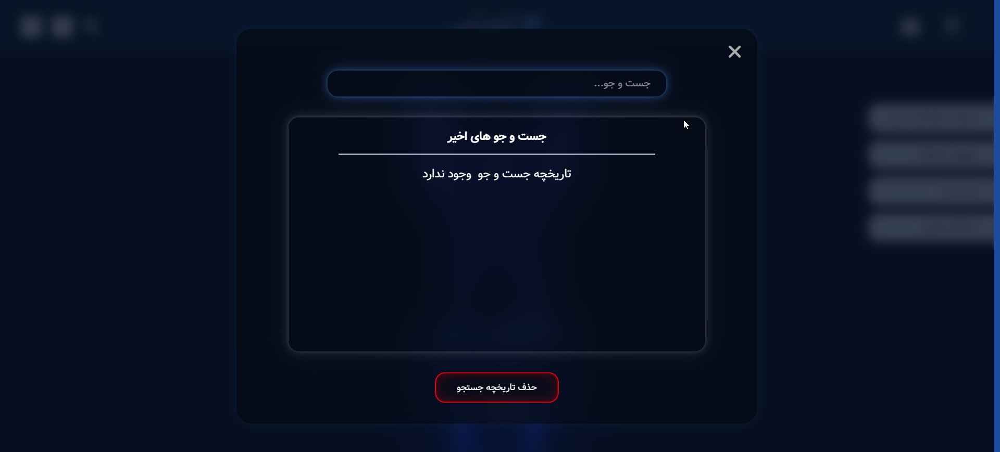
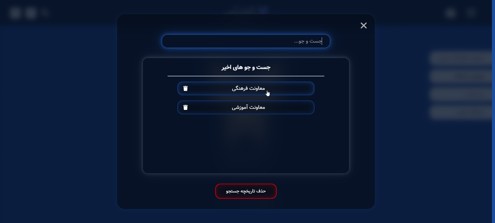
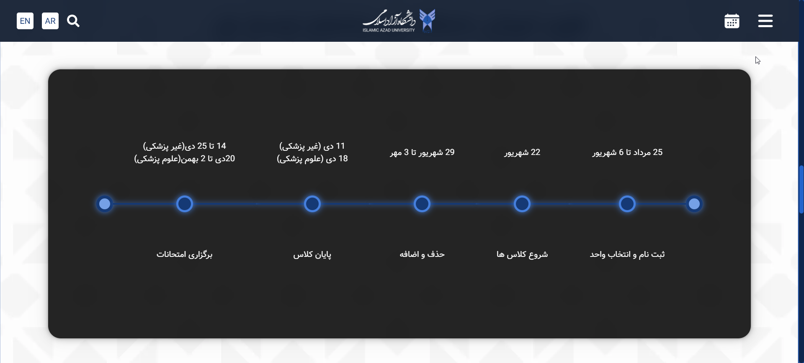
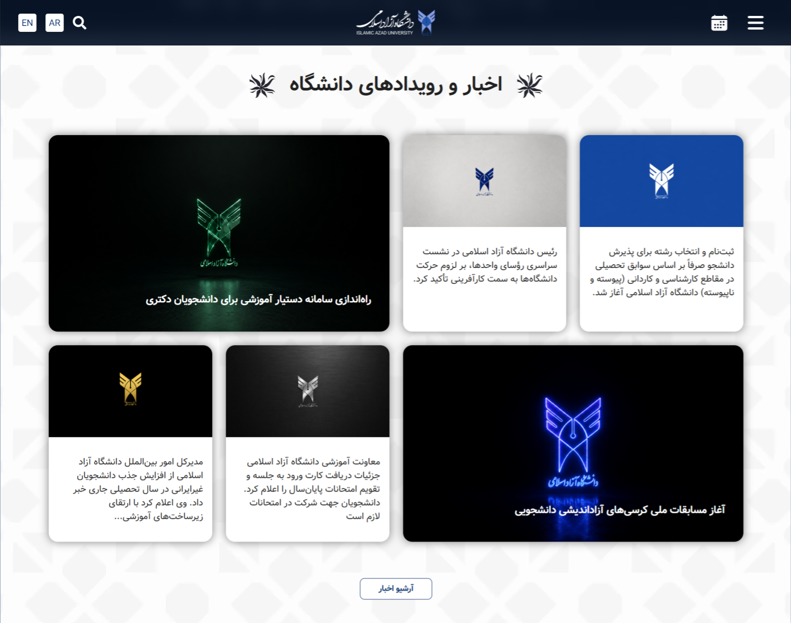
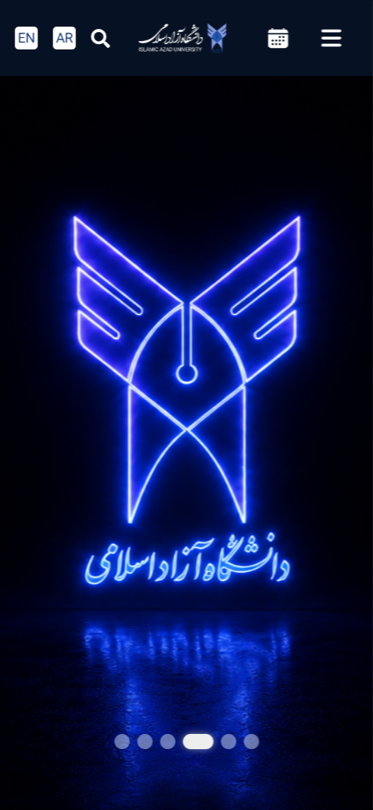
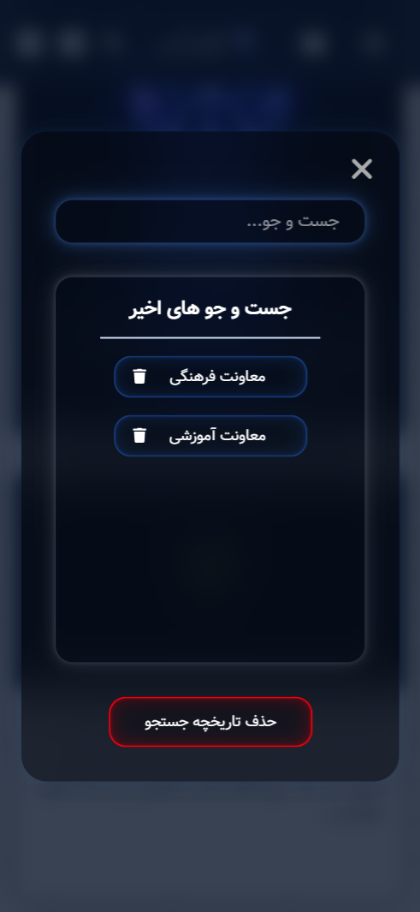
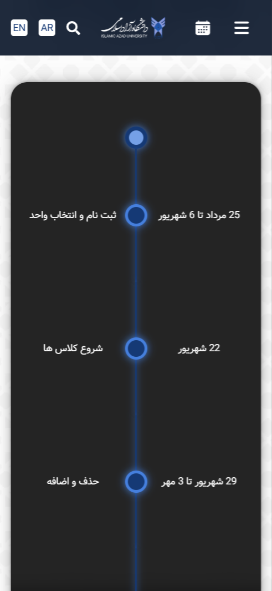

# Islamic Azad University (IAU) - Modern Landing Page

A high-performance, modular, and fully responsive landing page for IAU, engineered with React, Vite, and TypeScript. This project focuses on clean architecture, type safety, and a seamless user experience.

## 🚀 Key Features

- **Modern Tech Stack**: Powered by **React** and **Vite** for near-instantaneous hot module replacement (HMR).
- **TypeScript Core**: Robust type-checking across the entire application using centralized interfaces in `src/shared/types`.
- **Component-Driven Development**: A highly modular structure featuring custom UI elements like `Accordion`, `Slider`, `Timeline`, and `StatCard`.
- **Custom Hooks Engine**:
  - `useScroll`: For performance-optimized scroll tracking.
  - `useLocalStorage`: To handle persistent state across sessions.
  - `useRecentSearch`: A specialized hook for managing user search history.
- **Responsive Design**: Fully optimized for all screen sizes, from mobile devices to large desktop monitors.
- **Clean Code Architecture**: Separated into `Layout`, `Components`, `Hooks`, and `Shared` layers for maximum maintainability.

---

## 📸 Preview

### Desktop view

<p align="center">
  
    <br>
    <br>
  
    <br>
    <br>
  
    <br>
    <br>
  
    <br>
    <br>
  
      <br>
    <br>
</p>

### Mobile view

<p align="center">
  
    <br>
    <br>
  
    <br>
    <br>
  
    <br>
    <br>

</p>

---

## 🛠 Technology Stack

- **Framework**: [React](https://reactjs.org/)
- **Build Tool**: [Vite](https://vitejs.dev/)
- **Language**: [TypeScript](https://www.typescriptlang.org/)
- **Stylin**: CSS3 (Modular Approach)
- **Quality Control**: [ESLint](https://eslint.org/) & [Prettier](https://prettier.io/)

---

## 📂 Project Structure

The codebase follows a scalable directory pattern:

```text
src/
├── components/      # Reusable UI Blocks (Search, Slider, Accordion, etc.)
├── hooks/           # Logic Abstractions (useScroll, useClickOutside, etc.)
├── layout/          # Larg Semantic Sections (Header, Footer, NewsSection)
├── shared/          # Centralized Project Assets
│   ├── types/       # Global TypeScript Interfaces & Definitions
│   └── ui/          # Atomic UI elements (Button, Heading)
├── App.tsx          # Main Layout Entry Point
└── main.tsx         # Application Bootstrapper
```

---

## ⚙️ Installation & Usage

### Steps to Run Locally

1. **Clone the Repository**:

```bash
   git clone https://github.com/your-username/iau-landing-page.git
   cd iau-landing-page
```

2. **Install Dependencies**:

```bash
 npm install
```

3. **Start the Development Server**:

```bash
   npm run dev
```

The application will be available at http://localhost:5173.

## 🧠 Engineering Insights

### Optimized State Persistence

The application utilizes a custom useLocalStorage hook to ensure that user preferences and recent search queries are persisted locally. This reduces unnecessary data re-entry and improves the perceived performance for returning visitors.

### Type-Safe UI Components

By defining strict interfaces for components like Card, StatCard, and Timeline, we ensure that data passed through the application is consistent. This approach significantly reduces runtime errors and provides excellent IDE auto-completion for developers.

### Scroll & Interaction Logic

useScroll: Optimized to track vertical movement for dynamic header transitions without causing layout thrashing.
useClickOutside: Enhances UX by automatically closing dropdowns or search overlays when a user clicks elsewhere.
